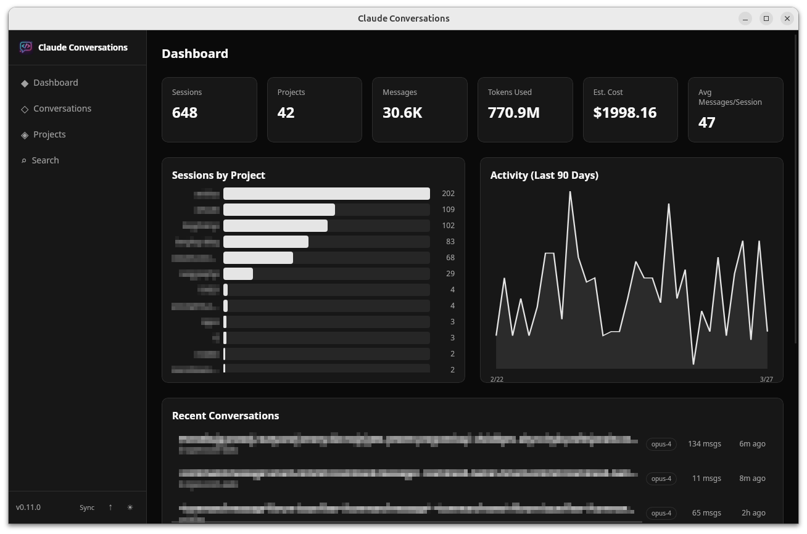
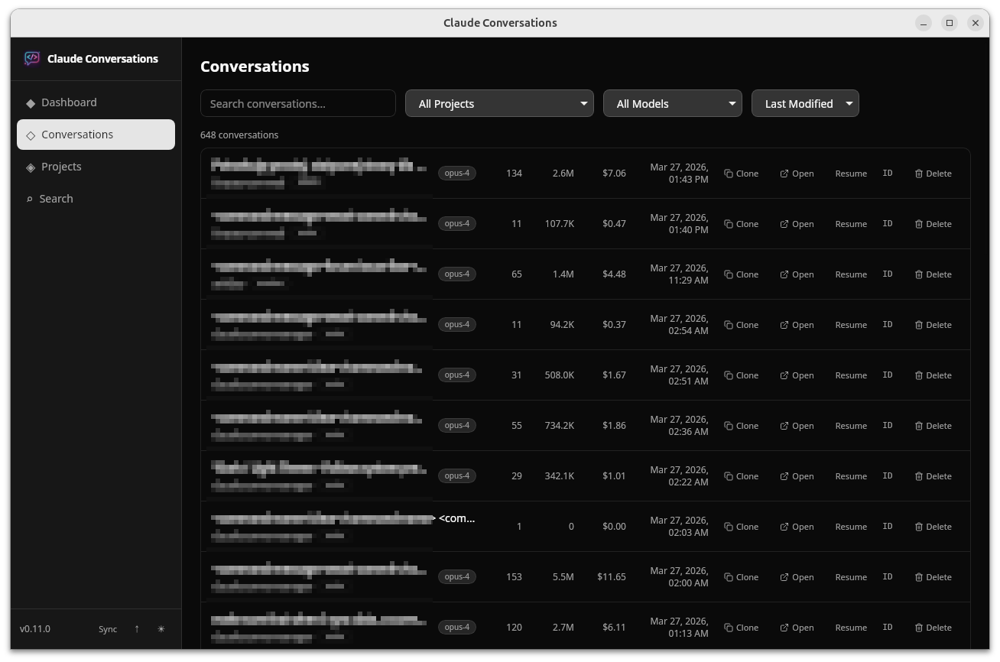
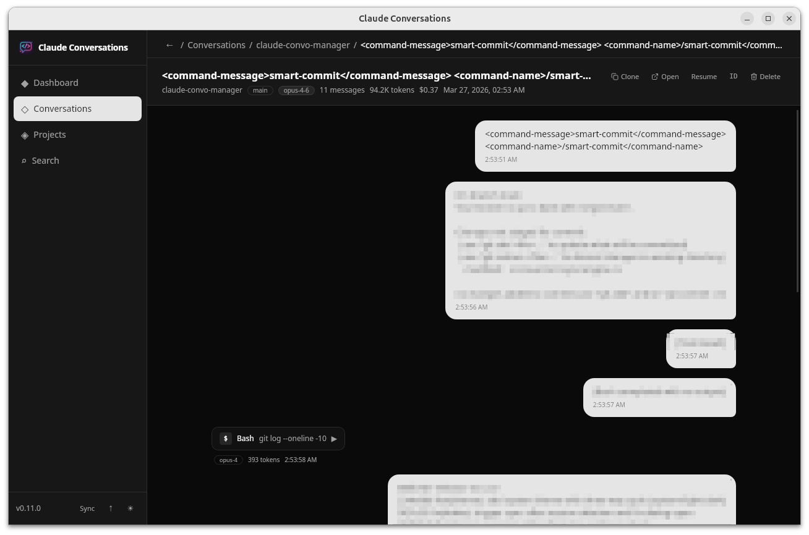
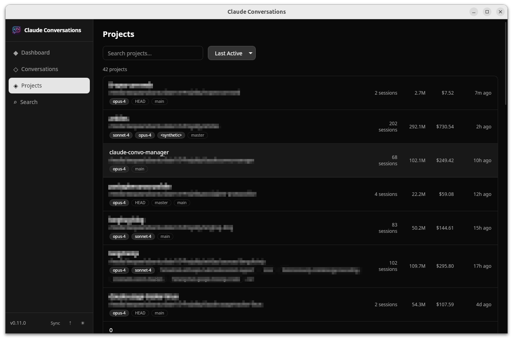
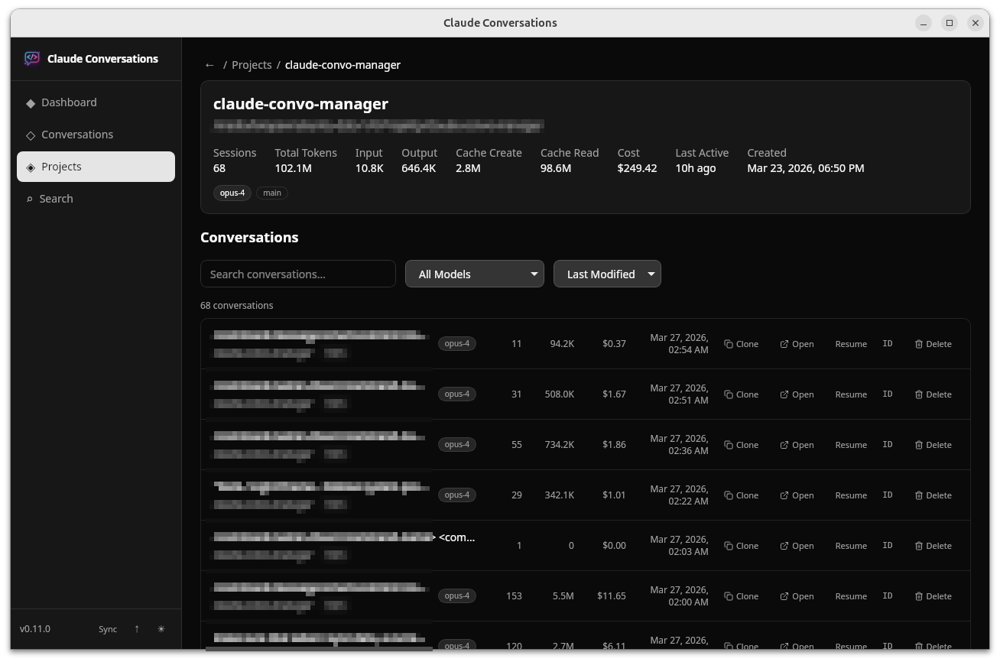
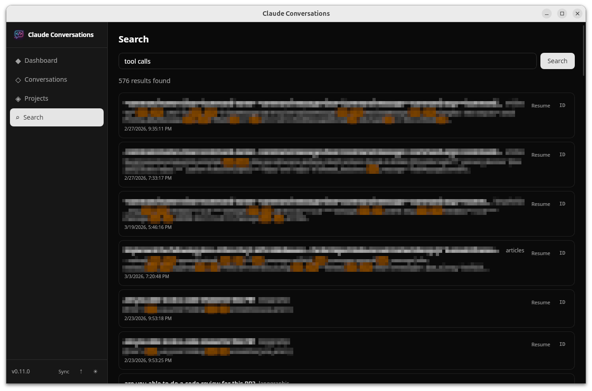

<p align="center">
  
</p>

# Claude Conversations

A desktop application for indexing, searching, and analyzing your [Claude Code](https://docs.anthropic.com/en/docs/claude-code) conversation history. Built with [Tauri](https://tauri.app/), [SvelteKit](https://svelte.dev/docs/kit), and [Rust](https://www.rust-lang.org/).

## Features

- **Dashboard** - Overview of token usage, project breakdown, activity trends, and recent sessions
- **Conversation Browser** - Browse and filter sessions by project, git branch, model, date range, and more
- **Full-Text Search** - Search across all messages with FTS5 full-text indexing (Porter stemming + Unicode)
- **Conversation Viewer** - Read conversations with Markdown rendering, syntax-highlighted code blocks, and tool-use display
- **In-Conversation Search & Replace** - Ctrl+F to search within a conversation with highlighted matches, match counter, and prev/next navigation; Ctrl+H to open replace mode for single or bulk text replacement in the source JSONL
- **Inline Rename** - Double-click any conversation title to rename it (in the session list or viewer header)
- **Project Browser** - Browse all projects with session counts, token usage, cost estimates, model/branch tags, and search/sort; drill into a project to see its conversations with filtering
- **Clone to Project** - Clone any conversation into a different project with a new session UUID; copies the full JSONL history, subagent files, metadata, and tags; rewrites project paths in cloned messages; searchable project dropdown
- **Delete Session** - Delete a conversation with a confirmation dialog; removes the JSONL file, subagent directory, and all database records
- **Open in IDE / Terminal** - Auto-detects installed editors (VS Code, Cursor, Zed, JetBrains, etc.) and terminals (Alacritty, Kitty, WezTerm, etc.) and opens the project directory; the terminal launches `claude --resume` to continue the conversation directly
- **Token & Cost Tracking** - Tracks input, output, cache creation, and cache read tokens with estimated API costs
- **Sync** - Reads and indexes conversations directly from `~/.claude/` into a local SQLite database
- **Tagging & Favorites** *(planned)* - Organize sessions with custom tags, favorites, and notes
- **Auto-Update** - Checks for new versions via GitHub Releases with signature verification; downloads, shows progress, and restarts in-place
- **Dark / Light Theme** - Follows system preference or manual toggle

## Download

[**Latest release**](../../releases/latest) - pre-built binaries for Linux, macOS, and Windows.

## Screenshots

<table>
  <tr>
    <td align="center"><a href="screenshots/ccm-1.png"></a><br><b>Dashboard</b></td>
    <td align="center"><a href="screenshots/ccm-2.png"></a><br><b>Conversations</b></td>
  </tr>
  <tr>
    <td align="center"><a href="screenshots/ccm-3.png"></a><br><b>Conversation Viewer</b></td>
    <td align="center"><a href="screenshots/ccm-4.png"></a><br><b>Projects</b></td>
  </tr>
  <tr>
    <td align="center"><a href="screenshots/ccm-5.png"></a><br><b>Project Detail</b></td>
    <td align="center"><a href="screenshots/ccm-6.png"></a><br><b>Full-Text Search</b></td>
  </tr>
</table>

## Prerequisites

- [Node.js](https://nodejs.org/) (LTS)
- [Rust](https://www.rust-lang.org/tools/install) (1.77.2+)
- Platform-specific dependencies:

**Ubuntu / Debian**

```bash
sudo apt-get install -y libwebkit2gtk-4.1-dev libappindicator3-dev librsvg2-dev patchelf
```

**macOS** - Xcode Command Line Tools (`xcode-select --install`)

**Windows** - [Visual Studio Build Tools](https://visualstudio.microsoft.com/visual-cpp-build-tools/) with "Desktop development with C++"

## Getting Started

```bash
# Clone the repository
git clone https://github.com/<your-username>/claude-convo-manager.git
cd claude-convo-manager

# Install frontend dependencies
npm install

# Start the app in development mode (launches Tauri window with hot reload)
npm run tauri dev
```

Click the **Sync** button to discover and index your Claude Code conversations from `~/.claude/`.

## Scripts

| Command              | Description                                      |
| -------------------- | ------------------------------------------------ |
| `npm run tauri dev`  | Start the app in development mode with hot reload |
| `npm run tauri build`| Build production binaries and installers          |
| `npm run dev`        | Start the Vite dev server only (no Tauri window)  |
| `npm run build`      | Build the SvelteKit frontend to `/build`          |
| `npm run check`      | Run svelte-check for type errors                  |
| `npm run check:watch`| Run svelte-check in watch mode                    |

## Tech Stack

### Frontend

- **SvelteKit 2** + **Svelte 5** - Compiler-based reactive UI framework
- **Tailwind CSS 4** - Utility-first styling
- **bits-ui** - Headless accessible UI components
- **layerchart** - Data visualization (dashboard charts)
- **marked** + **highlight.js** - Markdown rendering with syntax highlighting
- **lucide-svelte** - Icons

### Backend

- **Rust** - Core logic and data processing
- **Tauri 2** - Lightweight desktop runtime bridging web frontend and Rust backend
- **SQLite** (via rusqlite) - Local database with WAL mode
- **FTS5** - Full-text search with Porter stemming
- **r2d2** - Connection pooling (8 connections)
- **notify** - File system watching (planned)
- **tokio** - Async runtime
- **serde** - Serialization/deserialization

## Project Structure

```
claude-convo-manager/
├── src/                        # SvelteKit frontend
│   ├── lib/
│   │   ├── api/                # Tauri command invocations
│   │   ├── components/         # UI components
│   │   │   ├── dashboard/      #   Dashboard stats, charts
│   │   │   ├── conversations/  #   Session list, filters, rename, open-in
│   │   │   ├── projects/       #   Project filter panel
│   │   │   ├── viewer/         #   Message display, markdown
│   │   │   ├── search/         #   Search form & results
│   │   │   ├── layout/         #   Sidebar, theme toggle
│   │   │   └── ui/             #   Base components (bits-ui)
│   │   ├── stores/             # Svelte 5 state (sync, theme, IDE detection)
│   │   └── types/              # TypeScript type definitions
│   └── routes/                 # File-based routing
│       ├── +page.svelte        #   Dashboard (home)
│       ├── conversations/      #   Conversation browser & viewer
│       ├── projects/           #   Project list & detail pages
│       └── search/             #   Search page
├── src-tauri/                  # Rust backend
│   ├── src/
│   │   ├── lib.rs              # App initialization & plugin registration
│   │   ├── commands/           # Tauri IPC commands
│   │   │   ├── sessions.rs     #   Session CRUD & filtering
│   │   │   ├── messages.rs     #   Message retrieval
│   │   │   ├── search.rs       #   Full-text search
│   │   │   ├── analytics.rs    #   Dashboard statistics
│   │   │   ├── rename.rs       #   Session rename (file + DB)
│   │   │   ├── clone.rs        #   Clone session to another project
│   │   │   ├── replace.rs     #   Search & replace in messages
│   │   │   ├── delete.rs      #   Session deletion (file + DB)
│   │   │   ├── projects.rs     #   Project listing with stats
│   │   │   ├── ide.rs          #   IDE/terminal detection & launch
│   │   │   └── sync.rs         #   Sync trigger
│   │   ├── sync/               # Sync engine
│   │   │   ├── engine.rs       #   Main sync algorithm
│   │   │   ├── parsers.rs      #   Claude JSONL file parsing
│   │   │   ├── path_encoder.rs #   Project path encoding
│   │   │   └── token_calculator.rs # Cost estimation
│   │   ├── db/                 # Database layer
│   │   │   ├── mod.rs          #   Connection pool setup
│   │   │   └── schema.rs       #   SQLite schema & FTS5
│   │   └── types/              # Rust data structures
│   └── tauri.conf.json         # Tauri app configuration
├── .github/workflows/build.yml # CI: cross-platform builds
├── package.json
└── vite.config.ts
```

## How It Works

1. **Sync** - The app reads `~/.claude/history.jsonl` and `~/.claude/projects/*/` to discover conversation sessions. Each session's JSONL file is parsed and indexed into a local SQLite database.
2. **Index** - Messages are stored with full metadata (tokens, model, git branch, working directory, tool usage) and indexed using SQLite FTS5 for fast full-text search.
3. **Browse** - The frontend queries the Rust backend via Tauri IPC commands with filtering, pagination, and sorting.
4. **Analyze** - Dashboard aggregates token usage, project breakdowns, and activity patterns from the indexed data.

## Data Storage

The SQLite database is stored in the platform-specific app data directory:

| Platform | Path                                                  |
| -------- | ----------------------------------------------------- |
| Linux    | `~/.local/share/claude-conversations/ccm.db`          |
| macOS    | `~/Library/Application Support/claude-conversations/ccm.db` |
| Windows  | `%APPDATA%\claude-conversations\ccm.db`               |

## Building for Production

```bash
npm run tauri build
```

This produces platform-specific installers in `src-tauri/target/release/bundle/`:

- **Linux** - `.deb`, `.rpm`, `.AppImage`
- **macOS** - `.dmg`, `.app` (both aarch64 and x86_64)
- **Windows** - `.exe`, `.msi`

> **Note (Linux):** All Linux formats - including `.AppImage` - require `libwebkit2gtk-4.1` on the host system. Most GNOME-based distros (Ubuntu, Fedora) ship it by default; KDE-based distros (Kubuntu, KDE Neon) may not. Install it with:
>
> ```bash
> # Debian/Ubuntu
> sudo apt-get install -y libwebkit2gtk-4.1-0
> # Fedora
> sudo dnf install webkit2gtk4.1
> ```

## CI/CD

Two GitHub Actions workflows handle builds:

- **CI** (`.github/workflows/ci.yml`) - builds on every push to `main` and on PRs to verify the build succeeds
- **Release** (`.github/workflows/release.yml`) - builds and creates a draft GitHub Release when a `v*` tag is pushed

Platforms: macOS (aarch64 + x86_64), Ubuntu 22.04, Windows.

To create a release: `npm run release <version>` then `git push && git push origin v<version>`.

> **Note:** Code signing for macOS and Windows is supported but currently disabled (no certificates configured). Apps will show security warnings (Gatekeeper on macOS, SmartScreen on Windows).

To enable signing, add the following secrets to the GitHub repository:

**macOS** (signing + notarization):

| Secret | Description |
| --- | --- |
| `APPLE_CERTIFICATE` | Base64-encoded `.p12` Apple Developer certificate |
| `APPLE_CERTIFICATE_PASSWORD` | Password for the `.p12` export |
| `KEYCHAIN_PASSWORD` | Any password (for the temporary CI keychain) |
| `APPLE_SIGNING_IDENTITY` | e.g. `Developer ID Application: Your Name (TEAMID)` |
| `APPLE_ID` | Apple ID email (for notarization) |
| `APPLE_PASSWORD` | App-specific password from appleid.apple.com |
| `APPLE_TEAM_ID` | 10-character Apple Developer Team ID |

**Windows**:

| Secret | Description |
| --- | --- |
| `WINDOWS_CERTIFICATE` | Base64-encoded `.pfx` code signing certificate |
| `WINDOWS_CERTIFICATE_PASSWORD` | Password for the `.pfx` file |

## Blog

Follow development updates and articles on **[langhug.blog](https://langhug.blog/)**.

## Feedback & Issues

Found a bug or have an idea for a feature? [Open an issue](../../issues/new) - all feedback is welcome and helps shape the project.

## Contributing

1. Fork the repository
2. Create a feature branch (`git checkout -b feature/my-feature`)
3. Commit your changes
4. Push to the branch (`git push origin feature/my-feature`)
5. Open a Pull Request

## License

This project is licensed under the [MIT License](LICENSE).
